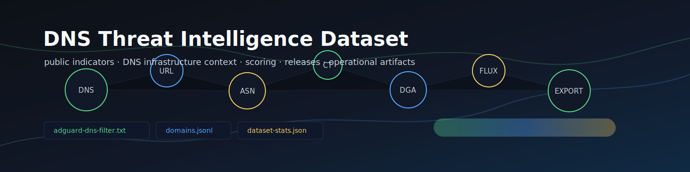

<p align="center">
  
</p>

# DNS-Threat-Intelligence-dataset

DNS-Threat-Intelligence-dataset is an open-source DNS threat intelligence
pipeline for collecting public indicators, normalizing them into typed records,
enriching infrastructure context, scoring evidence, and publishing operational
artifacts for DNS filtering, SIEM ingestion, analytics, and research workflows.

<p align="center">
  <a href="https://github.com/ipanalytics/DNS-Threat-Intelligence-dataset/actions/workflows/test.yml">
    
  </a>
  <a href="https://github.com/ipanalytics/DNS-Threat-Intelligence-dataset/actions/workflows/pages.yml">
    
  </a>
  <a href="https://github.com/ipanalytics/DNS-Threat-Intelligence-dataset/releases">
    
  </a>
  
  
  
</p>

<p align="center">
  <a href="https://ipanalytics.github.io/DNS-Threat-Intelligence-dataset/">Dashboard</a>
  ·
  <a href="https://github.com/ipanalytics/DNS-Threat-Intelligence-dataset/releases">Releases</a>
  ·
  <a href="./docs/output-schemas.md">Schemas</a>
  ·
  <a href="./docs/adapter-authoring.md">Adapter authoring</a>
  ·
  <a href="./docs/active-dns-safety.md">DNS safety</a>
</p>

---

## Overview

The project turns public DNS/security intelligence feeds into a reproducible
dataset with source attribution and operational artifacts. Adapters collect
public URL, domain, and IP indicators, the normalization layer canonicalizes
domains, URLs, and IPs, and exporters publish blocklists, JSONL, CSV, reports,
dashboard data, and GitHub Release assets.

Production workflows collect from live public feeds that do not require
credentials. Fixture mode is retained for tests, local smoke checks, and adapter
development; fixture output is not intended to represent threat-intelligence
coverage.

---

## System Behavior

```text
public feeds
        |
        v
source adapters -> Evidence[]
        |
        v
normalization -> domains / URLs / IPs
        |
        v
scoring -> confidence / reason codes / recommended action
        |
        v
artifacts -> DNS lists / JSONL / CSV / reports / dashboard / releases
```

The pipeline is designed around explicit evidence rather than opaque blocklist
membership. Every indicator can carry source metadata, category labels,
timestamps, confidence, and a recommended action.

---

## Features

| Area | Capability |
|---|---|
| Feed ingestion | URLhaus, ThreatFox, FeodoTracker, OpenPhish, public-dns.info |
| Normalization | URL parsing, domain extraction, IDN/punycode handling, eTLD+1 approximation, IP validation, defang/refang support |
| Source accounting | Per-source evidence, domain, URL, IP, status, and skip reason statistics |
| Publishing | Plain DNS lists, AdGuard DNS filter, JSONL, CSV, Markdown reports, dashboard JSON, GitHub Releases |
| Automation | CI, scheduled dataset build, GitHub Pages deployment, release workflow with attached artifacts |

---

## Dataset Stats

<!-- DNSINTEL_STATS_START -->
_Generated: `2026-06-19T07:02:02.396594+00:00`_

| Dataset metric | Count |
|---|---:|
| Malicious domains | 1579 |
| Phishing domains | 263 |
| Malware domains | 1579 |
| C2 domains | 1116 |
| Malicious IPs | 1698 |
| C2 IPs | 1698 |
| Open resolvers | 62790 |
| Malicious URLs | 4293 |
| AdGuard DNS rules | 4151 |
| Normalized domain records | 1579 |
| Normalized URL records | 4297 |
| Enriched files | 1 |
| Reports | 2 |
<!-- DNSINTEL_STATS_END -->

The stats block is managed by `scripts/update_stats.py` and refreshed by the
dataset/release workflows.

---

## Quick Start

```bash
git clone https://github.com/ipanalytics/DNS-Threat-Intelligence-dataset.git
cd DNS-Threat-Intelligence-dataset

uv sync --all-groups
uv run python -m dnsintel.cli config validate
uv run python scripts/update_feeds.py --live --output data
uv run python scripts/update_stats.py --data-dir data --readme README.md
uv run python -m dnsintel.cli dashboard build --data-dir data --output docs/dashboard
```

Run the verification suite:

```bash
uv run ruff format --check .
uv run ruff check .
uv run pytest
uv run python -m compileall dnsintel scripts
```

---

## Installation

The project uses [`uv`](https://github.com/astral-sh/uv) for dependency
management.

```bash
uv sync --all-groups
```

For local CLI use without relying on console-script installation:

```bash
uv run python -m dnsintel.cli --help
uv run python -m dnsintel.cli config validate
```

---

## Usage Examples

Collect from live public feeds:

```bash
uv run python scripts/update_feeds.py --live --output data
```

Generate the small fixture-backed development snapshot:

```bash
uv run python scripts/update_feeds.py --sample --output data
```

Regenerate derived list files:

```bash
uv run python scripts/generate_lists.py --input data --output data
```

Update README/dashboard statistics:

```bash
uv run python scripts/update_stats.py --data-dir data --readme README.md
```

Build release assets locally:

```bash
uv run python scripts/build_release_assets.py --data-dir data --output dist/release
```

Build the static dashboard:

```bash
uv run python -m dnsintel.cli dashboard build \
  --data-dir data \
  --output docs/dashboard
```

---

## Outputs And Artifacts

| Path | Purpose |
|---|---|
| `data/lists/malicious-domains.txt` | Plain domain blocklist |
| `data/lists/phishing-domains.txt` | Phishing domain list |
| `data/lists/malware-domains.txt` | Malware-associated domain list |
| `data/lists/c2-domains.txt` | C2 domain list |
| `data/lists/malicious-ips.txt` | Public malicious IP list from IP-oriented sources |
| `data/lists/c2-ips.txt` | C2 IP list |
| `data/lists/open-resolvers.txt` | Public DNS resolver list |
| `data/lists/malicious-urls.txt` | Malicious URL list |
| `data/lists/adguard-dns-filter.txt` | AdGuard DNS filter rules |
| `data/normalized/domains.jsonl` | Normalized domain indicators |
| `data/normalized/urls.jsonl` | Normalized URL indicators |
| `data/enriched/source-summary.csv` | Source-level collection statistics |
| `data/enriched/*.csv` | Source summary and enabled enrichment tables |
| `data/reports/*.md` | Human-readable update and risk reports |
| `data/dashboard/*.json` | Dashboard metrics and dataset statistics |
| `docs/dashboard/index.html` | Static dashboard published through GitHub Pages |
| `dist/release/*` | Locally generated release payloads |

Every dataset release includes `adguard-dns-filter.txt`, the plain text lists,
normalized JSONL records, dataset statistics, and zipped list/enrichment
bundles.

---

## Data Format

Core records are represented by Pydantic models under `dnsintel.models`.

### Domain Indicator

```json
{
  "domain": "c2-control.evil",
  "etld1": "c2-control.evil",
  "category": ["c2", "malware"],
  "sources": ["threatfox"],
  "confidence": "critical",
  "score": 95.0,
  "recommended_action": "block_domain",
  "evidence": [
    {
      "source_name": "threatfox",
      "indicator_type": "domain",
      "value": "c2-control.evil",
      "category": ["c2", "malware"],
      "confidence": 95.0
    }
  ]
}
```

### Recommended Actions

| Action | Meaning |
|---|---|
| `monitor` | Track the indicator; insufficient confidence to block |
| `block_domain` | Suitable for DNS/domain blocking workflows |
| `block_url` | URL-level blocking is preferred |
| `block_ip` | IP-level action is acceptable for the specific evidence context |
| `do_not_block_shared_infra` | Indicator is on shared infrastructure; avoid broad IP/ASN blocking |
| `needs_review` | Weak or contextual signal requiring analyst review |

---

## Operational Notes

- Live integrations should be enabled per source in `configs/sources.yml`.
- CI uses deterministic tests; dataset, Pages, and release workflows use live
  public feeds by default.
- Default live builds only publish artifacts backed by currently enabled public
  feeds.
- Set `ABUSECH_AUTH_KEY` as a GitHub Actions secret to let ThreatFox use the
  authenticated abuse.ch API path; public exports remain the fallback.
- Registration-gated sources are kept out of default runs until credentials and
  source-specific terms are configured.

---

## GitHub Actions

| Workflow | Trigger | Purpose |
|---|---|---|
| `test` | push, pull request | Ruff, pytest, compile checks |
| `build-dataset-artifacts` | manual, scheduled | Rebuild data artifacts and upload workflow artifact |
| `pages` | push to `main`, manual | Build and deploy the static dashboard |
| `dataset-release` | manual, scheduled | Build dataset release assets and create a GitHub Release |

To publish a new dataset release:

```bash
gh workflow run dataset-release -f tag=dataset-YYYYMMDD
```

If `tag` is omitted, the workflow creates a UTC timestamped dataset tag.

---

## Deployment

GitHub Pages is deployed from the `pages` workflow using the generated
`docs/dashboard` directory.

Repository settings required:

| Setting | Value |
|---|---|
| Pages source | GitHub Actions |
| Default branch | `main` |
| Actions permissions | Read/write for release workflow |

The live dashboard is available at:

```text
https://ipanalytics.github.io/DNS-Threat-Intelligence-dataset/
```

---

## Project Scope

This repository is intended for:

- DNS filtering and resolver policy pipelines
- SOC/SIEM enrichment workflows
- threat intelligence research
- abuse desk and infrastructure risk reporting
- fraud/risk indicator analysis
- data engineering over public security feeds

The project focuses on public, attributable, reproducible intelligence. Source
adapters are designed to make provenance and confidence visible at ingestion
time instead of hiding that context in final blocklists.

---

## Directory Structure

```text
.
├── configs/              # source, scoring, allowlist, and brand configuration
├── data/                 # generated lists, normalized records, enrichment, reports
├── dnsintel/             # Python package
│   ├── sources/          # source adapters
│   ├── normalize/        # domain, URL, IP normalization
│   ├── dns/              # optional DNS resolver utilities
│   ├── enrich/           # optional enrichment utilities
│   ├── ct/               # optional certificate transparency utilities
│   ├── dga/              # optional lexical DGA scoring
│   ├── flux/             # optional fast-flux scoring utilities
│   ├── osint/            # optional public-code/report IOC extraction
│   ├── scoring/          # confidence and action recommendation logic
│   ├── storage/          # JSONL, CSV, DuckDB, Parquet helpers
│   └── dashboard/        # static dashboard generator
├── docs/                 # operational docs and generated dashboard
├── scripts/              # dataset, stats, and release asset commands
└── tests/                # fixture-backed test suite
```

<details>
<summary>Maintainer commands</summary>

```bash
# rebuild sample data and dashboard
uv run python scripts/update_feeds.py --sample --output data
uv run python scripts/update_stats.py --data-dir data --readme README.md
uv run python -m dnsintel.cli dashboard build --data-dir data --output docs/dashboard

# build local release payloads
uv run python scripts/build_release_assets.py --data-dir data --output dist/release

# run checks
uv run ruff format --check .
uv run ruff check .
uv run pytest
uv run python -m compileall dnsintel scripts
```

</details>

---

## Limitations

- The checked-in dataset is generated from public live feeds available at build
  time; fixture mode is reserved for tests and local adapter development.
- Some commercial or registration-gated sources are represented as disabled
  adapters or optional integration points.
- Public feed schemas can change; adapters should be tested against fixtures and
  reviewed before enabling production ingestion.

---

## License

MIT. See [LICENSE](./LICENSE).

---

## Disclaimer

This project publishes defensive DNS threat intelligence artifacts from public
or user-authorized sources. Operators are responsible for validating source
terms, tuning false-positive policy, and reviewing blocking decisions before
production enforcement.
